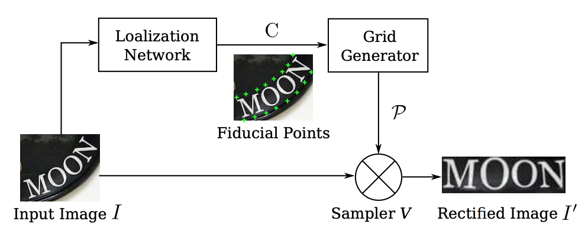

# Robust Scene Text Recognition with Automatic Rectification
論文概述：定位出街景招牌影像中不規則（irregular）的字體，包含斜視角（perspetive）、彎曲（curved）等形狀，並讓影像更具有可讀性（readable）。此論文模型為RARE，結合Spatial TransformerNetwork（STN）及Squence Recognition Network（SRN）。由於傳統STN只能旋轉和縮放影像，具有無法校正perspetive和curved影像的限制，所以此論文使用Thin Plate Spine(TPS) transformation改善。

## 模型架構 

此架構分成三個部分：
* Localization Network
* Grid generator
* Sampler

## 程式碼說明
* STN.py：此程式碼為Localization network的網路架構設計

## 相關論文連結

[Robust Scene Text Recognition with Automatic Rectification](https://arxiv.org/abs/2009.14082](https://www.cv-foundation.org/openaccess/content_cvpr_2016/html/Shi_Robust_Scene_Text_CVPR_2016_paper.html)https://www.cv-foundation.org/openaccess/content_cvpr_2016/html/Shi_Robust_Scene_Text_CVPR_2016_paper.html)

[Spatial Transformer Networks](https://proceedings.neurips.cc/paper_files/paper/2015/hash/33ceb07bf4eeb3da587e268d663aba1a-Abstract.html)
